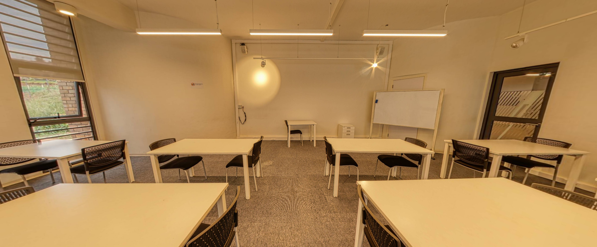
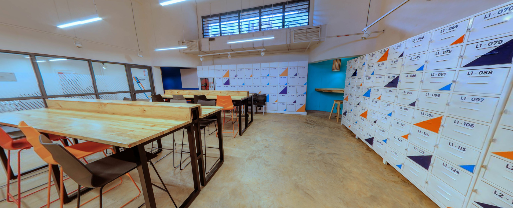
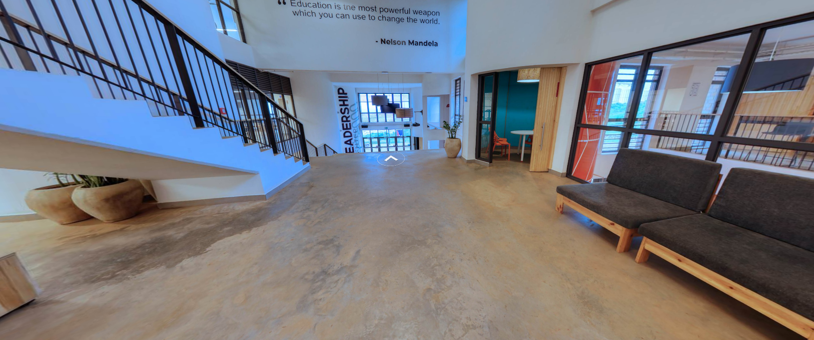
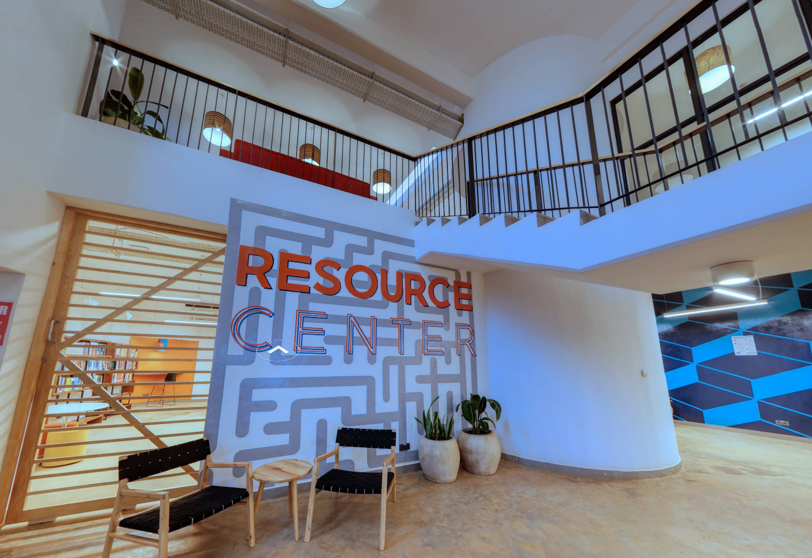

# 360 Walkthrough of ALU Rwanda: A Student’s Journey

## Project Overview
This project provides an immersive 360-degree walkthrough of selected areas on the ALU Rwanda campus, allowing users to experience a typical day for a student moving from the Gambia classroom to the resource center. The walkthrough offers a quick tour of what many ALU students experience on campus, focusing on a realistic path taken daily.

## Selected Areas
The walkthrough captures the following key locations:

- **Gambia Classroom**

A classroom named after the country Gambia, where in-person learning takes place. This room represents a typical ALU class experience.

- **Gambia Lobby**

A lobby outside the Gambia classroom, equipped with lockers and high tables where students can store their belongings and relax between classes. All classes have similar spaces right outside.

- **Leadership Center & Resource Center Path** 

This area connects the leadership center and resource center, providing a calm, open space for students to transition between these vital areas.

- **Resource Center (Library)**
 
The final stop, where students can access books and other study materials. A hub for academic resources on campus.

## Interactive Elements
This 360 walkthrough includes the following interactive buttons:

- **Start**: A button to begin the experience.
- **Instructions**: A button that displays how to navigate the walkthrough.
- **Move Between Locations**: Buttons that allow users to transition smoothly between each space.
- **Quit**: A button that allows the user to exit the walkthrough at the end of the experience (or intro scene).

## Reason for Selection
The walkthrough was designed to give prospective and new students a glimpse into the daily life of an ALU student. The chosen path—from the classroom to the resource center—represents a typical student journey on campus, showing how students move between classes, take breaks in the lobby, and eventually reach the resource center to study.
